# Generating API Clients from OpenAPI

How we stopped suffering and started generating

<div class="abs-br m-6 flex gap-2">
  <span class="text-sm opacity-50">Annual Conference • February 2026</span>
</div>

<!--
Hi everyone! Today I want to talk about an approach we adopted across several projects
that radically changed the way we work with APIs on the frontend.
-->

---
transition: fade-out
layout: center
---

# 🤔 Sound familiar?

<v-clicks>

- 📝 Manually writing types for **every single endpoint** — then keeping them in sync
- 🤷 Types that **look correct** but silently **drift** from the actual API
- 😤 Backend renamed a field — frontend sends the **old name**, gets a **400 Bad Request**
- 👻 A field **stopped showing up** in the UI — turns out it was renamed on the backend

</v-clicks>

<!--
Let's start with something every frontend developer knows.
Backend renamed a field — and frontend still sends the old name, resulting in a 400.
Or a field just disappears from the UI because backend renamed it without telling us.
Then there's the manual type writing, hardcoded URL strings,
and types that look fine — until the backend changes something and nobody tells you.
-->

---
layout: default
---

# What it looked like "before"

We had a well-structured abstraction — but everything was **manual**:

<div class="grid grid-cols-2 gap-4">

<div>

```typescript
// Manually written types for every entity
export type TUser = {
  readonly id: number;
  readonly email: string;
  readonly firstName: string;
  readonly lastName: string;
  readonly avatar: TFile | null;
};

// Hardcoded URL constants
const ENDPOINT_LOGIN = '/api/login-check';
const ENDPOINT_LOGOUT = '/api/logout';
```

</div>

<div>

```typescript
// Class-based API client wrapping fetch
class AuthApi extends ApiClient {
  login(
    username: string,
    password: string,
  ) {
    return this.post<TLoginResponse>(
      ENDPOINT_LOGIN,
      { body: { username, password } },
    ).then((data) => {
      this.userStore
        .setAccessToken(data.refresh_token);
      return data;
    });
  }
}
```

</div>
</div>


<!--
Here's what our real "before" looked like — and it wasn't bad code.
We had a proper class hierarchy, typed responses, hardcoded URL constants.
But the fundamental problem remains: every type is manually written.
Backend renames a field — and the frontend has NO idea until runtime.
No compile-time safety, no contract between frontend and backend.
-->

---
layout: default
---

# 🤖 "Maybe AI can generate code?"

We tried that too — gave AI (ChatGPT, Copilot, Cursor) a OpenAPI spec:

- ❌ **Non-deterministic** — every run produces a different result
- ❌ **Hallucinations** — invents fields, forgets `nullable`
- ❌ **Doesn't scale** — 100+ endpoints through a prompt?
- ❌ **Can't integrate into CI/CD** — unreliable for automation


<!--
We also tried the AI approach — ChatGPT, GitHub Copilot, Cursor.
We gave them a swagger spec and asked to generate types.
But it's non-deterministic, hallucinates, and doesn't scale.
-->

---
layout: center
class: text-center
---

# 💡 OpenAPI → TypeScript is a formal transformation, not a creative task.

<div class="mt-8 text-xl opacity-80">
  Don't use AI where the problem can be solved <strong>algorithmically</strong>.
</div>

<!--
This is the key insight. Converting an OpenAPI spec to TypeScript types
is a purely algorithmic task. It requires 100% accuracy, not "approximately correct".
AI is great for creative tasks, but for formal transformations
you need a deterministic tool — one that produces the same correct output every time.
-->

---
layout: center
---

# 🎯 What we wanted

<div class="w-full flex justify-center mt-14" style="transform: scale(2.8); transform-origin: top center;">


</div>

<!--
We wanted a simple flow: backend updates the API, the spec updates,
we regenerate types and client with one command.
But here's the key part — then we run TypeScript type checking.
If the backend renamed a field, the generated types change,
and TypeScript immediately shows errors in every component that used the old name.
We catch inconsistencies at compile time, not from angry users in production.
And in CI — tsc runs on every pull request, so broken types simply can't get into main.
-->

---
layout: default
---

# 📊 Library overview

Tools we evaluated:

| | Library | What it generates | Key traits |
|---|---|---|---|
| 1️⃣ | **swagger-typescript-api** | TS client (Fetch/Axios) | Simple, single file, TS-only |
| 2️⃣ | **openapi-generator-cli** | Clients for 50+ languages | Enterprise, **requires Java** ☕ |
| 3️⃣ | **openapi-typescript** | Types only (no runtime) | Minimal footprint |
| 4️⃣ | **orval** | Types + hooks + mocks | React Query, Vue Query, Zod, MSW |

<v-click>

<div class="mt-6 grid grid-cols-4 gap-2 text-center text-xs">
  <div class="p-2 bg-gray-500/10 rounded">
    <div class="font-bold">swagger-ts-api</div>
    <div class="opacity-60">⭐ 4.1k</div>
  </div>
  <div class="p-2 bg-gray-500/10 rounded">
    <div class="font-bold">openapi-generator</div>
    <div class="opacity-60">⭐ 25.8k</div>
  </div>
  <div class="p-2 bg-gray-500/10 rounded">
    <div class="font-bold">openapi-typescript</div>
    <div class="opacity-60">⭐ 7.9k</div>
  </div>
  <div class="p-2 bg-green-500/10 border border-green-500/30 rounded">
    <div class="font-bold text-green-400">orval ✅</div>
    <div class="opacity-60">⭐ 5.4k</div>
  </div>
</div>

</v-click>

<!--
We evaluated 4 main libraries.
swagger-typescript-api — simple, but no framework hooks.
openapi-generator — enterprise-grade, but requires Java.
openapi-typescript — types only, no runtime.
Orval — full integration with React Query, Vue Query, MSW mock generation, and Zod schemas.
-->

---
layout: two-cols
layoutClass: gap-8
---

# 🏆 Why Orval?

<v-clicks>

- 🔌 **Framework hooks** out of the box
  - React Query `useQuery` / `useMutation`
  - Vue Query, SWR, Angular
- 🧩 **Custom mutator** — your own HTTP client
  - Axios with interceptors
  - Native fetch with cookies
- 📂 **`tags-split`** — clean code split by tags
  - `generated/auth/auth.ts`
  - `generated/users/users.ts`
- 🧪 **MSW mocks** — testing without a backend
- ✅ **Zod schemas** — runtime validation

</v-clicks>

::right::

<div class="mt-12">

```bash
# One command — and you're done
npx orval

# What you get:
src/services/api/generated/
├── auth/
│   └── auth.ts          # usePostApiLoginCheck()
├── users/
│   └── users.ts         # useGetApiUsers()
├── projects/
│   └── projects.ts      # useGetApiProjects()
└── models/
    ├── userApiResource.ts
    ├── projectResource.ts
    └── ... (96 models)
```

</div>

<!--
Why did we choose Orval? First, it generates ready-to-use React Query hooks out of the box.
Second, it supports custom mutators — you can use your own axios or fetch with all interceptors.
Third, the tags-split mode gives you clean code, organized by API tags.
And as a bonus — you can generate MSW mocks for testing.
-->

---
layout: default
---

# ⚙️ orval.config.ts — one config, different projects

<div class="grid grid-cols-2 gap-4">

<div>

### Vue 3 + Fetch (ZipStay)

```typescript {all|3|5-6|8-11|all}
import { defineConfig } from 'orval';

export default defineConfig({
  zenstay: {
    input: {
      target: './var/api-doc.json',
    },
    output: {
      mode: 'tags-split',
      target: './src/api/generated',
      schemas: './src/api/generated/models',
      client: 'fetch',
      baseUrl: '/',
      override: {
        mutator: {
          path: './src/api/custom-fetch.ts',
          name: 'customFetch',
        },
      },
    },
  },
});
```

</div>

<div>

### React 19 + React Query (Doc2Bid)

```typescript {all|3|5-6|8-11|13-18|all}
import { defineConfig } from 'orval';

export default defineConfig({
  'doc2bid-api': {
    input: {
      target: './var/api-doc.json',
    },
    output: {
      mode: 'tags-split',
      target: './src/services/api/generated',
      schemas: './src/services/api/generated/models',
      client: 'react-query',
      baseUrl: '/',
      override: {
        mutator: {
          path: './src/services/api/client/axios-client.ts',
          name: 'customAxiosClient',
        },
        query: {
          useQuery: true,
          useMutation: true,
          signal: true,
        },
      },
    },
  },
});
```

</div>
</div>

<!--
Here are actual configs from our projects. On the left — ZipStay on Vue with native fetch.
On the right — Doc2Bid on React with React Query and Axios.
The config structure is the same — only the client and mutator change.
One tool — different frameworks, different HTTP clients.
-->

---
layout: default
---

# 🔧 Custom Mutator — adapting to your HTTP client

<div class="grid grid-cols-2 gap-4">

<div>

### Native Fetch (ZipStay)

```typescript {all|1-4|6-10|12-15|all}
export const customFetch = async <T>(
  url: string,
  options: RequestInit = {},
): Promise<T> => {
  const { VUE_API_BASEPATH } = getAppEnvironment();
  const fullUrl = new URL(url, VUE_API_BASEPATH).href;

  const requestInit: RequestInit = {
    ...options,
    headers: { ...options.headers },
    credentials: 'include', // 🍪 cookies
  };

  const response = await fetch(fullUrl, requestInit);
  const data = await APIResponseHandler(response);

  return {
    status: response.status,
    data,
    headers: response.headers,
  } as T;
};
```

</div>

<div>

### Axios (Doc2Bid)

```typescript {all|1-4|6-9|11-18|all}
export const customAxiosClient = <T>(
  url: string,
  requestConfig: AxiosRequestConfig
): Promise<AxiosResponse<T>> => {
  const axiosConfig: AxiosRequestConfig = {
    ...requestConfig,
    url,
  };

  // Orval passes body → Axios expects data
  if ('body' in requestConfig && requestConfig.body) {
    const body = requestConfig.body;
    axiosConfig.data = body instanceof FormData
      ? body
      : typeof body === 'string'
        ? JSON.parse(body)
        : body;
    delete (axiosConfig as any).body;
  }

  return axiosInstance(axiosConfig);
  // ☝️ axiosInstance has interceptors:
  //    JWT refresh queue, error toasts,
  //    FormData detection
};
```

</div>
</div>

<!--
The custom mutator is the heart of the integration. It's an adapter function between Orval and your HTTP client.
On the left — native fetch for Vue with cookie-based auth.
On the right — axios for React with a token refresh queue and error handling via interceptors.
Orval knows nothing about your auth logic — it just calls the mutator.
-->

---
layout: two-cols
layoutClass: gap-8
---

# ⚡ Before vs After

### ❌ Before

```typescript
// Manual API call
type User = any;

const getUsers = async () => {
  const response = await axios.get(
    '/api/v1/users'
  );
  return response.data;
};

// In component:
const [users, setUsers] = useState<any[]>([]);
const [loading, setLoading] = useState(true);

useEffect(() => {
  getUsers()
    .then(setUsers)
    .catch(console.error)
    .finally(() => setLoading(false));
}, []);
```

::right::

<div class="mt-12">

### ✅ After

```typescript
// Generated React Query hook
import {
  useGetApiUsers
} from '@/services/api/generated/users/users';
import type {
  UserApiResource
} from '@/services/api/generated/models';

// In component — one line:
const { data, isLoading } = useGetApiUsers(
  { page: 1, perPage: 20 },
  {
    query: {
      staleTime: 5 * 60 * 1000,
      enabled: true,
    },
  }
);

const users: UserApiResource[] =
  data?.data?.items || [];
// ☝️ Full type-safety, caching,
//    automatic refetch, loading state
```

</div>

<!--
Here's the most important part — before and after comparison.
On the left — manual code: any types, hardcoded URL, manual loading state, useEffect...
On the right — one line useGetApiUsers — and we get full type-safety, caching,
automatic refetch, loading and error state out of the box.
-->

---
layout: default
---

# 🏗️ 3 projects — 1 approach

<div class="grid grid-cols-3 gap-4 mt-6">

<div class="p-4 bg-green-500/10 border border-green-500/20 rounded-lg">

### 🏠 ZipStay
<div class="text-sm mt-2 space-y-1">

- **Vue 3** + Pinia
- Orval **v7.3** • `fetch`
- Custom `customFetch`
- Cookie-based auth
- 25+ API tags

</div>
</div>

<div class="p-4 bg-blue-500/10 border border-blue-500/20 rounded-lg">

### 🏥 HealUp
<div class="text-sm mt-2 space-y-1">

- **React 19** + Zustand
- Orval **v7.17** • `react-query`
- Custom `customAxiosClient`
- TanStack Query 5
- Templates, Steps API

</div>
</div>

<div class="p-4 bg-purple-500/10 border border-purple-500/20 rounded-lg">

### 📄 Doc2Bid
<div class="text-sm mt-2 space-y-1">

- **React 19** + Zustand
- Orval **v8.0-rc** • `react-query`
- JWT refresh queue
- 96+ models
- Auth, Projects, Bids

</div>
</div>

</div>

<v-click>

<div class="mt-6 text-center">

| Metric | Before (manual code) | After (Orval) |
|---|---|---|
| New endpoint integration time | ~30 minutes | **~2 minutes** |
| API layer type-safety | ~20% (any) | **100%** |
| One config → multiple frameworks | ❌ | **Vue + React** |
| Errors on API changes | In production 🔥 | **At compile time** 🛡️ |

</div>

</v-click>

<!--
Here are three real projects where we use this approach.
ZipStay — Vue, HealUp and Doc2Bid — React. Different Orval versions, different HTTP clients,
but the same pattern. Time to integrate a new endpoint — from 30 minutes down to 2.
And most importantly — errors are caught at compile time, not in production.
-->

---
layout: center
---

# 🔄 How it works in practice

```mermaid
graph LR
    A[🖥️ Backend] -->|Generates| B[📋 OpenAPI Spec]
    B -->|Copy to| C[📁 var/api-doc.json]
    C -->|npm run api:generate| D[⚡ Orval]
    D -->|Generates| E[📂 generated/]
    E -->|Contains| F[🪝 Hooks + Types]
    F -->|Used in| G[🧩 Components]

    style A fill:#3b82f6,stroke:#1e40af,color:#fff
    style D fill:#8b5cf6,stroke:#6d28d9,color:#fff
    style F fill:#10b981,stroke:#047857,color:#fff
```

<div class="mt-6">



</div>

<v-click>

<div class="mt-6 grid grid-cols-3 gap-4 text-center text-sm">

<div class="p-3 bg-blue-500/10 rounded">

**1. Get the spec**
```bash
# From the backend team
cp swagger.json var/api-doc.json
```

</div>

<div class="p-3 bg-purple-500/10 rounded">

**2. Generate**
```bash
npm run api:generate
# or: npx orval
```

</div>

<div class="p-3 bg-green-500/10 rounded">

**3. Use it**
```typescript
import { useGetApiUsers }
  from '@/api/generated/users/users';
```

</div>

</div>

</v-click>

<!--
The process is very simple. The backend generates an OpenAPI spec.
We copy it into the project, run orval — and get ready-to-use hooks and types.
Three steps — and the API layer is done.
-->

---
layout: default
---

# ⚠️ Gotchas

Things to keep in mind:

<v-clicks>

<div class="p-3 mt-2 bg-orange-500/10 border-l-4 border-orange-500 rounded">
  <strong>📋 OpenAPI spec quality</strong><br>
  <span class="text-sm">Orval generates exactly what's described in the spec. If the backend doesn't document fields — they won't appear in the types. <strong>Agree with your backend team</strong> on documentation quality.</span>
</div>

<div class="p-3 mt-2 bg-orange-500/10 border-l-4 border-orange-500 rounded">
  <strong>📁 Gitignore vs Commit</strong><br>
  <span class="text-sm">We gitignore generated code (ZipStay, HealUp). Doc2Bid commits it. Both approaches work — just agree within your team.</span>
</div>

<div class="p-3 mt-2 bg-orange-500/10 border-l-4 border-orange-500 rounded">
  <strong>🔄 Version migrations</strong><br>
  <span class="text-sm">ZipStay started with Orval 7.3, Doc2Bid is already on 8.0-rc. Major versions require custom mutator adaptation (e.g., signature changes).</span>
</div>

<div class="p-3 mt-2 bg-orange-500/10 border-l-4 border-orange-500 rounded">
  <strong>🧩 Custom Mutator</strong><br>
  <span class="text-sm">Writing the initial mutator requires understanding how Orval shapes requests. But it's a <strong>one-time cost</strong> — after that it works for all endpoints.</span>
</div>

</v-clicks>

<!--
Let's be honest about the gotchas.
The most important one — the quality of the swagger spec. If the backend doesn't document fields, Orval can't generate them.
Also agree within your team — commit generated code or not.
And major Orval updates require mutator adaptation — but that's a one-time task.
-->

---
layout: center
class: text-center
---

# 🚀 Try it yourself!

<div class="mt-8 space-y-4">

```bash
# 1. Install
npm install -D orval

# 2. Create config
npx orval init

# 3. Generate
npx orval
```

</div>

<div class="mt-8 grid grid-cols-3 gap-6 text-center">
  <div>
    <div class="text-2xl mb-2">📖</div>
    <a href="https://orval.dev" target="_blank" class="text-blue-400">orval.dev</a>
    <div class="text-xs opacity-50">Documentation</div>
  </div>
  <div>
    <div class="text-2xl mb-2">🐙</div>
    <a href="https://github.com/orval-labs/orval" target="_blank" class="text-blue-400">GitHub</a>
    <div class="text-xs opacity-50">orval-labs/orval</div>
  </div>
  <div>
    <div class="text-2xl mb-2">🎮</div>
    <a href="https://orval.dev/playground" target="_blank" class="text-blue-400">Playground</a>
    <div class="text-xs opacity-50">Try it online</div>
  </div>
</div>

<v-click>

<div class="mt-8 p-4 bg-green-500/10 border border-green-500/30 rounded-lg">
  <strong>TL;DR:</strong> One config → types + hooks + client.<br>
  Works with Vue, React, Angular. Fetch, Axios — doesn't matter.<br>
  <strong>3 projects. 0 manual types. 100% type-safety.</strong>
</div>

</v-click>

<!--
Three steps to get started: install, create config, generate.
Documentation at orval.dev, there's an online playground to experiment with.
Thank you for your attention! Happy to answer any questions.
-->

---
layout: center
class: text-center
---

# Thank you! 🙏

## Questions?

<div class="mt-8">
  <QrLink value="https://b-vadym.github.io/open-api-client-gen" :size="180" level="M" />
  <div class="mt-3 text-sm">
    <a href="https://b-vadym.github.io/open-api-client-gen" target="_blank" class="text-blue-400">
      b-vadym.github.io/open-api-client-gen
    </a>
  </div>
</div>

<div class="mt-8 opacity-50 text-sm">

Generating API Clients from OpenAPI • Annual Conference 2026

</div>
