# Generating API Clients from OpenAPI

How we stopped suffering and started generating

<div class="abs-br m-6 flex gap-2">
  <span class="text-sm opacity-50">Annual Conference • February 2026</span>
</div>

<!--
Hi everyone! Today I want to talk about an approach we adopted across several projects
that radically changed the way we work with APIs on the frontend.
-->

---
transition: fade-out
layout: center
---

# 🤔 Sound familiar?

<v-clicks>

- 📝 Manually writing types for **every single endpoint** — then keeping them in sync
- 🤷 Types that **look correct** but silently **drift** from the actual API
- 😤 Backend renamed a field — frontend sends the **old name**, gets a **400 Bad Request**
- 👻 A field **stopped showing up** in the UI — turns out it was renamed on the backend

</v-clicks>

<!--
Let's start with something every frontend developer knows.
Backend renamed a field — and frontend still sends the old name, resulting in a 400.
Or a field just disappears from the UI because backend renamed it without telling us.
Then there's the manual type writing, hardcoded URL strings,
and types that look fine — until the backend changes something and nobody tells you.
-->

---
layout: default
---

# What it looked like "before"

We had a well-structured abstraction — but everything was **manual**:

<div class="grid grid-cols-2 gap-4">

<div>

```typescript
// Manually written types for every entity
export type TUser = {
  readonly id: number;
  readonly email: string;
  readonly firstName: string;
  readonly lastName: string;
  readonly avatar: TFile | null;
};

// Hardcoded URL constants
const ENDPOINT_LOGIN = '/api/login-check';
const ENDPOINT_LOGOUT = '/api/logout';
```

</div>

<div>

```typescript
// Class-based API client wrapping fetch
class AuthApi extends ApiClient {
  login(
    username: string,
    password: string,
  ) {
    return this.post<TLoginResponse>(
      ENDPOINT_LOGIN,
      { body: { username, password } },
    ).then((data) => {
      this.userStore
        .setAccessToken(data.refresh_token);
      return data;
    });
  }
}
```

</div>
</div>


<!--
Here's what our real "before" looked like — and it wasn't bad code.
We had a proper class hierarchy, typed responses, hardcoded URL constants.
But the fundamental problem remains: every type is manually written.
Backend renames a field — and the frontend has NO idea until runtime.
No compile-time safety, no contract between frontend and backend.
-->

---
layout: default
---

# 🤖 "Maybe AI can generate code?"

We tried that too — gave AI (ChatGPT, Copilot, Cursor) a OpenAPI spec:

- ❌ **Non-deterministic** — every run produces a different result
- ❌ **Hallucinations** — invents fields, forgets `nullable`
- ❌ **Doesn't scale** — 100+ endpoints through a prompt?
- ❌ **Can't integrate into CI/CD** — unreliable for automation


<!--
We also tried the AI approach — ChatGPT, GitHub Copilot, Cursor.
We gave them a swagger spec and asked to generate types.
But it's non-deterministic, hallucinates, and doesn't scale.
-->

---
layout: center
class: text-center
---

# 💡 OpenAPI → TypeScript is a formal transformation, not a creative task.

<div class="mt-8 text-xl opacity-80">
  Don't use AI where the problem can be solved <strong>algorithmically</strong>.
</div>

<!--
This is the key insight. Converting an OpenAPI spec to TypeScript types
is a purely algorithmic task. It requires 100% accuracy, not "approximately correct".
AI is great for creative tasks, but for formal transformations
you need a deterministic tool — one that produces the same correct output every time.
-->

---
layout: center
---

# 🎯 What we wanted

```mermaid
%%{init: {'theme':'base','themeVariables':{'fontSize':'22px'}}}%%
flowchart LR
  A[📄 Backend] --> B[📋 OpenAPI Spec]
  B --> C[⚡ Generate]
  C --> D[🛡️ Type Check]

  classDef s1 fill:#3b82f620,stroke:#3b82f6,stroke-width:4px,color:#dbeafe,font-size:30px;
  classDef s2 fill:#22c55e20,stroke:#22c55e,stroke-width:4px,color:#dcfce7,font-size:30px;
  classDef s3 fill:#a855f720,stroke:#a855f7,stroke-width:4px,color:#f3e8ff,font-size:30px;
  classDef s4 fill:#ef444420,stroke:#ef4444,stroke-width:5px,stroke-dasharray: 8 6,color:#fee2e2,font-size:30px;

  class A s1
  class B s2
  class C s3
  class D s4

  linkStyle 0,1,2 stroke:#9ca3af,stroke-width:3px;
```

<div class="w-full flex justify-center mt-14" style="transform: scale(2.8); transform-origin: top center;">



</div>

<!--
We wanted a simple flow: backend updates the API, the spec updates,
we regenerate types and client with one command.
But here's the key part — then we run TypeScript type checking.
If the backend renamed a field, the generated types change,
and TypeScript immediately shows errors in every component that used the old name.
We catch inconsistencies at compile time, not from angry users in production.
And in CI — tsc runs on every pull request, so broken types simply can't get into main.
-->

---
layout: default
---

# 📊 Library overview

| Library | What it generates | Key traits |
|---|---|---|
| **[swagger-typescript-api](https://github.com/acacode/swagger-typescript-api)** | TS client (Fetch / Axios) | Single-file output, simple setup |
| **[openapi-generator-cli](https://github.com/OpenAPITools/openapi-generator)** | Clients for 50+ languages | Multi-language, enterprise, **needs Java** ☕ |
| **[openapi-typescript](https://github.com/openapi-ts/openapi-typescript)** | Types only (zero runtime) | Minimal footprint, pairs with `openapi-fetch` |
| **[hey-api/openapi-ts](https://github.com/hey-api/openapi-ts)** | SDK + types + Zod | Plugin arch, 7 clients, TanStack Query |
| **[orval](https://github.com/orval-labs/orval)** | Types + client + hooks + mocks | Fetch, Axios, React/Vue Query, MSW, Zod |

<v-click>

<div class="mt-2 grid grid-cols-5 gap-1 text-center text-xs">
  <div class="p-1.5 bg-gray-500/10 rounded flex flex-col items-center gap-1">
    
    <a href="https://github.com/acacode/swagger-typescript-api" target="_blank" class="font-bold text-gray-300 hover:text-blue-400 text-[11px] leading-tight">swagger-ts-api</a>
    <div class="opacity-60 text-[10px]">⭐ 4.1k</div>
    <div class="opacity-50 text-[10px]">📦 508k/week • v13.2</div>
  </div>
  <div class="p-1.5 bg-gray-500/10 rounded flex flex-col items-center gap-1">
    
    <a href="https://github.com/OpenAPITools/openapi-generator" target="_blank" class="font-bold text-gray-300 hover:text-blue-400 text-[11px] leading-tight">openapi-generator</a>
    <div class="opacity-60 text-[10px]">⭐ 25.8k</div>
    <div class="opacity-50 text-[10px]">📦 1.1M/week • v2.28</div>
  </div>
  <div class="p-1.5 bg-gray-500/10 rounded flex flex-col items-center gap-1">
    
    <a href="https://github.com/openapi-ts/openapi-typescript" target="_blank" class="font-bold text-gray-300 hover:text-blue-400 text-[11px] leading-tight">openapi-typescript</a>
    <div class="opacity-60 text-[10px]">⭐ 7.9k</div>
    <div class="opacity-50 text-[10px]">📦 2.4M/week • v7.13</div>
  </div>
  <div class="p-1.5 bg-gray-500/10 rounded flex flex-col items-center gap-1">
    
    <a href="https://github.com/hey-api/openapi-ts" target="_blank" class="font-bold text-gray-300 hover:text-blue-400 text-[11px] leading-tight">hey-api/openapi-ts</a>
    <div class="opacity-60 text-[10px]">⭐ 4.1k</div>
    <div class="opacity-50 text-[10px]">📦 1.6M/week • v0.92</div>
  </div>
  <div class="p-1.5 bg-green-500/10 border border-green-500/30 rounded flex flex-col items-center gap-1">
    
    <a href="https://github.com/orval-labs/orval" target="_blank" class="font-bold text-green-400 hover:text-green-300 text-[11px] leading-tight">orval ✅</a>
    <div class="opacity-60 text-[10px]">⭐ 5.4k</div>
    <div class="opacity-50 text-[10px]">📦 765k/week • v8.3</div>
  </div>
</div>

</v-click>

<!--
We evaluated 5 main libraries.
swagger-typescript-api — simple, but no framework hooks.
openapi-generator — enterprise-grade, but requires Java.
openapi-typescript — types only, no runtime.
hey-api/openapi-ts — modern with plugin system, supports both Fetch and Axios.
Orval — full integration with React Query, Vue Query, MSW mock generation, and Zod schemas.
-->

---
layout: two-cols
layoutClass: gap-8
---

# 🏆 Why Orval?

<v-clicks>

- � **Clean file structure** — `tags-split` mode
  - One file per API tag, models in separate dir
  - `generated/auth/auth.ts`
  - `generated/bookings/bookings.ts`
- 🛡️ **Full TypeScript type-safety**
  - Every request / response / param is typed
  - Rename on backend → compile error on frontend
- 🧩 **Native fetch or Axios** + custom mutator
  - Your own HTTP client with interceptors
  - Cookie auth, JWT refresh — all supported
- 🎁 **Bonus:** MSW mocks, Zod schemas, React/Vue Query hooks

</v-clicks>

::right::

<div class="mt-12">

```bash
# One command — and you're done
npm run api:generate

# ZipStay — real output:
src/api/generated/
├── auth/
│   └── auth.ts       # postApiLoginCheck()
├── bookings/
│   └── bookings.ts   # getApiBookingList()
├── properties/
│   └── properties.ts # getApiPropertyList()
├── guests/
│   └── guests.ts     # getApiGuestList()
├── ... (40 tag dirs)
└── models/
    └── ... (507 models)
# 547 files • 18k LoC • generated
```

</div>

<!--
Why did we choose Orval? First, it generates ready-to-use React Query hooks out of the box.
Second, it supports custom mutators — you can use your own axios or fetch with all interceptors.
Third, the tags-split mode gives you clean code, organized by API tags.
And as a bonus — you can generate MSW mocks for testing.
-->

---
layout: two-cols
layoutClass: gap-6
---

# ⚙️ orval.config.ts

```typescript {all|3-7|8-15|16-20|all}
import { defineConfig } from 'orval';

export default defineConfig({
  zenstay: {
    input: {
      target: './var/api-doc.json',
      validation: false,
    },
    output: {
      mode: 'tags-split',
      target: './src/api/generated',
      schemas: './src/api/generated/models',
      client: 'fetch',
      baseUrl: '/',
      mock: false,
      override: {
        mutator: {
          path: './src/api/custom-fetch.ts',
          name: 'customFetch',
        },
      },
    },
  },
});
```

::right::

<div class="mt-12 space-y-2.5 text-sm">

<div v-click="1" class="p-1.5 bg-blue-500/10 border-l-3 border-blue-500 rounded">
  <strong>📄 input.target</strong> — path to OpenAPI spec (JSON/YAML). Copied from backend repo into <code>var/</code>.
</div>

<div v-click="2" class="p-1.5 bg-purple-500/10 border-l-3 border-purple-500 rounded">
  <strong>📂 tags-split</strong> — each OpenAPI tag → separate file. Result: <code>auth/auth.ts</code>, <code>bookings/bookings.ts</code>, etc.
</div>

<div v-click="2" class="p-1.5 bg-green-500/10 border-l-3 border-green-500 rounded">
  <strong>🌐 client: 'fetch'</strong> — native fetch. Other options: <code>axios</code>, <code>react-query</code>, <code>vue-query</code>.
</div>

<div v-click="3" class="p-1.5 bg-orange-500/10 border-l-3 border-orange-500 rounded">
  <strong>🧩 override.mutator</strong> — your custom HTTP wrapper. Orval calls <code>customFetch()</code> for every request.
</div>

<div v-click="4" class="mt-2 p-1.5 bg-gray-500/10 rounded text-xs text-center opacity-70">
  ☝️ The entire setup — <strong>25 lines of config</strong>, and Orval does the rest
</div>

</div>

<!--
This is the actual config from ZipStay — our Vue 3 project.
The input section points to the OpenAPI spec file.
tags-split mode creates one file per API tag — clean and organized.
We chose native fetch as the client — no axios dependency needed.
And the mutator is the key piece — it's our custom fetch wrapper
that handles cookie auth, base URL, and error handling.
That's the entire setup — 25 lines of config, and Orval does the rest.
-->

---
layout: two-cols
layoutClass: gap-6
---

# 🔧 Custom Mutator

```typescript {all|1-3|4-6|8-12|14-19|all}
export const customFetch = async <T>(
  url: string, options: RequestInit = {},
): Promise<T> => {
  const { VUE_API_BASEPATH }
    = getAppEnvironment();
  const fullUrl = new URL(url, VUE_API_BASEPATH).href;

  const requestInit: RequestInit = {
    ...options,
    headers: { ...options.headers },
    credentials: 'include', // 🍪 cookies
  };

  const response = await fetch(fullUrl, requestInit);
  const data = await APIResponseHandler(response);

  return {
    status: response.status,
    data, headers: response.headers,
  } as T;
};
```

::right::

<div class="mt-11 space-y-2 text-sm">

<div v-click="1" class="p-1.5 bg-blue-500/10 border-l-3 border-blue-500 rounded">
  <strong>📋 Signature</strong> — Orval calls this for <strong>every</strong> request. Receives URL + fetch options.
</div>

<div v-click="2" class="p-1.5 bg-purple-500/10 border-l-3 border-purple-500 rounded">
  <strong>🌐 Base URL</strong> — reads <code>VUE_API_BASEPATH</code> from env. No hardcoded domains.
</div>

<div v-click="3" class="p-1.5 bg-green-500/10 border-l-3 border-green-500 rounded">
  <strong>🍪 credentials: 'include'</strong> — HttpOnly cookies (<code>jwt_hp</code>, <code>jwt_s</code>) sent automatically.
</div>

<div v-click="4" class="p-1.5 bg-orange-500/10 border-l-3 border-orange-500 rounded">
  <strong>🔄 Response handling</strong> — <code>APIResponseHandler</code> handles errors + auto-refreshes JWT on 401. Returns <code>{ status, data, headers }</code>.
</div>

<div v-click="5" class="mt-2 p-1.5 bg-gray-500/10 rounded text-xs text-center opacity-70">
  ☝️ Write once — works for all <strong>547 generated files</strong>
</div>

</div>

<!--
The custom mutator is the bridge between Orval and your HTTP client.
Orval doesn't know anything about your auth, base URL, or error handling.
It just calls customFetch for every request, passing url and options.
We build the full URL from environment config, set credentials to include
so that HttpOnly cookies with JWT tokens are sent automatically.
The APIResponseHandler takes care of error handling and automatic token refresh.
This is a one-time setup — write it once, and it works for all 547 generated files.
-->

---
layout: default
---

# What it looks like now

Everything is **generated** from OpenAPI spec — zero manual typing:

<div class="grid grid-cols-2 gap-4">

<div>

```typescript
// ✨ Generated types
// models/userApiResource.ts
export interface UserApiResource {
  id: number;
  email: string;
  roles: string[];
  /** @nullable */
  avatar?: FileApiResource;
  firstName: string;
  lastName: string;
}
```

</div>

<div>

```typescript
// ✨ Generated API client
// auth/auth.ts
export const postApiLoginCheck = async (
  body: PostApiLoginCheckBody,
  options?: RequestInit
): Promise<PostApiLoginCheckResponse> => {
  return customFetch<PostApiLoginCheckResponse>(
    '/api/login-check',
    {
      ...options,
      method: 'POST',
      headers: { 'Content-Type': 'application/json' },
      body: JSON.stringify(body),
    }
  );
};
```

</div>
</div>

<!--
And here's the "after" — the exact same functionality, but entirely generated.
Types match the backend 1:1. Function signatures are type-safe.
Backend renames a field — regenerate, and TypeScript immediately shows errors.
No manual updates, no drift, no guessing.
-->

---
layout: center
---

# 🔄 How it works in practice

```mermaid
graph LR
  A[🖥️ Backend] --> B[📄 API spec]
  B --> C[⚡ Generate client]
  C --> D[🪝 Typed hooks & models]
  D --> E[✅ Same in local and CI]

  style A fill:#3b82f6,stroke:#1e40af,color:#fff
  style C fill:#8b5cf6,stroke:#6d28d9,color:#fff
  style D fill:#10b981,stroke:#047857,color:#fff
```

<div class="mt-6">



</div>

<v-click>

<div class="mt-6 grid grid-cols-3 gap-4 text-center text-sm">

<div class="p-3 bg-blue-500/10 rounded">

**1. Backend updates API**
```bash
# one command for local refresh
make rebuild

# only regenerate spec + client
make generate-api-client
```

</div>

<div class="p-3 bg-purple-500/10 rounded">

**2. Frontend regenerates code**
```bash
cd frontend
yarn api:generate
```

</div>

<div class="p-3 bg-green-500/10 rounded">

**3. CI repeats the same flow**
```yaml
on every push / merge request:
spec -> generate -> build/tests
```

</div>

</div>

</v-click>

<!--
Simple message for the audience:
backend changes API -> frontend regenerates -> typed client is ready.
In CI this runs automatically for every code change (push/MR),
so the generated client is always validated in the pipeline.
-->

---
layout: default
---

# ⚠️ Reality Check · 1/2

<div class="mt-8 grid grid-cols-2 gap-6 text-sm">
  <div class="p-4 bg-red-500/10 border border-red-500/30 rounded-lg">
    <div class="text-base font-semibold">📋 Agreement risk</div>
    <ul class="mt-2 space-y-1.5 opacity-90">
      <li>Orval generates exactly what is in OpenAPI.</li>
      <li>Generic schemas (like <code>object</code>) produce weak types.</li>
      <li>Without clear spec ownership, quality degrades over time.</li>
    </ul>
  </div>
  <div class="p-4 bg-green-500/10 border border-green-500/30 rounded-lg">
    <div class="text-base font-semibold">🛡️ Team agreement</div>
    <ul class="mt-2 space-y-1.5 opacity-90">
      <li>Backend validates contract via <a href="https://github.com/thephpleague/openapi-psr7-validator" target="_blank" class="text-blue-400 hover:text-blue-300">league/openapi-psr7-validator</a>.</li>
      <li>Request/response is validated against OpenAPI.</li>
      <li>Backend and frontend review schema precision together.</li>
    </ul>
  </div>
</div>

<div class="mt-5 mx-auto w-fit px-4 py-1.5 rounded-full bg-white/10 border border-white/20 text-center text-[13px] font-semibold tracking-wide">Agreement #1: spec quality is a shared responsibility.</div>

<!--
Main risk #1: quality of OpenAPI spec.
Deterministic generation is only as good as the contract itself.
-->

---
layout: default
---

# ⚠️ Reality Check · 2/2

<div class="mt-8 grid grid-cols-2 gap-6 text-sm">
  <div class="p-4 bg-red-500/10 border border-red-500/30 rounded-lg">
    <div class="text-base font-semibold">📁 Agreement risk</div>
    <ul class="mt-2 space-y-1.5 opacity-90">
      <li>Mixed policy creates noisy PRs and recurring confusion.</li>
      <li>Developers follow different expectations per repository.</li>
      <li>CI and review process become inconsistent.</li>
    </ul>
  </div>
  <div class="p-4 bg-green-500/10 border border-green-500/30 rounded-lg">
    <div class="text-base font-semibold">✅ Team agreement</div>
    <ul class="mt-2 space-y-1.5 opacity-90">
      <li>We do <strong>not</strong> commit generated API code.</li>
      <li>Generated folders stay in <code>.gitignore</code>.</li>
      <li>CI regenerates client and validates build/tests.</li>
    </ul>
  </div>
</div>

<div class="mt-5 mx-auto w-fit px-4 py-1.5 rounded-full bg-white/10 border border-white/20 text-center text-[13px] font-semibold tracking-wide">Agreement #2: generated code is reproducible, so we keep git clean.</div>

<!--
Risk #2 is organizational.
Pick one policy and keep it stable.
-->

---
layout: default
---

# 🏗️ 3 projects — 1 approach

<div class="mt-5 text-[12px] leading-tight">

| Field | 🏠 ZipStay | 🏥 HealUp | 📄 Doc2Bid |
|---|---|---|---|
| Frontend stack | Vue **3** | React **19** | React **19** |
| State management | Pinia | Zustand | Zustand |
| Mode + client | `tags-split` + `fetch` | `tags-split` + `react-query` | `tags-split` + `react-query` |
| Mutator | `customFetch` | `customAxiosClient` | `customAxiosClient` |
| API endpoints (OpenAPI) | **41 paths / 133 operations** | **22 paths / 48 operations** | **15 paths / 28 operations** |

</div>

<!--
Current state snapshot across 3 products.
Same generation approach, adapted per domain and runtime needs.
-->

---
layout: two-cols
layoutClass: gap-8
---

# 🔮 Future Plan: Starter Projects

<div class="mt-2 flex items-center gap-3 text-sm">
  
  <a href="https://orval.dev" target="_blank" class="text-blue-400 hover:text-blue-300">orval.dev</a>
  <span class="opacity-50">•</span>
  <a href="https://github.com/orval-labs/orval" target="_blank" class="text-blue-400 hover:text-blue-300">GitHub</a>
</div>

<div class="mt-6 space-y-3 text-sm">

<div class="p-3 bg-blue-500/10 border border-blue-500/30 rounded-lg">
  <strong>Why it matters</strong><br>
  New projects start with the same API contract workflow from day one.
</div>

<div class="p-3 bg-purple-500/10 border border-purple-500/30 rounded-lg">
  <strong>What we standardize</strong><br>
  Shared `orval.config`, mutator pattern, and generation script.
</div>

</div>

::right::

<div class="mt-12">

```bash
# starter template baseline
npm run api:generate
npm run typecheck
```

<div class="mt-4 text-xs opacity-70">
Goal: one onboarding path across all new frontend projects.
</div>

</div>

<!--
Future direction #1: make Orval part of internal starter templates.
So teams begin with the same deterministic API workflow.
-->

---
layout: two-cols
layoutClass: gap-6
---

# 🧪 Worth Experimenting: Zod

<div class="mt-2 flex items-center gap-3 text-sm">
  
  <a href="https://zod.dev" target="_blank" class="text-blue-400 hover:text-blue-300">zod.dev</a>
  <span class="opacity-50">•</span>
  <span class="opacity-60">built into Orval</span>
</div>

<div class="mt-5 space-y-3 text-sm">

<div class="p-3 bg-amber-500/10 border border-amber-500/30 rounded-lg">
  <strong>The gap TypeScript doesn't fill</strong><br>
  TS errors disappear at runtime. If the backend breaks the contract silently — no compile error, just a broken UI.
</div>

<div class="p-3 bg-green-500/10 border border-green-500/30 rounded-lg">
  <strong>Orval already supports it</strong><br>
  One flag in <code>orval.config.ts</code> → Zod schemas generated alongside types. No extra tooling.
</div>

</div>

::right::

<div class="mt-6 space-y-3">

```typescript
// ✨ Generated from the same OpenAPI spec
export const userApiResourceSchema = z.object({
  id: z.number().int().positive(),
  email: z.string().email(),
  firstName: z.string().min(1).max(50),
  lastName: z.string().min(1).max(50),
  avatar: fileApiResourceSchema.nullable().optional(),
})
```

```typescript
// Runtime catch — if backend silently breaks contract
const raw = await getApiCurrentUser()
const user = userApiResourceSchema.parse(raw.data)
//                                  ^ throws before UI breaks
```

</div>

<!--
We're not shipping this tomorrow — but it's worth exploring.
TypeScript gives us compile-time safety, but at runtime there's no contract enforcement.
Orval already has built-in Zod support — one flag in the config, and schemas are generated alongside types from the same OpenAPI spec.
The idea: apply it surgically to critical endpoints like auth or payments.
If the backend silently breaks the contract, Zod throws immediately — before the broken data reaches the UI or the user.
-->

---
layout: two-cols
layoutClass: gap-6
---

# 🧪 Worth Experimenting: MSW

<div class="mt-2 flex items-center gap-3 text-sm">
  
  <a href="https://mswjs.io/docs" target="_blank" class="text-blue-400 hover:text-blue-300">mswjs.io/docs</a>
  <span class="opacity-50">•</span>
  <span class="opacity-60">built into Orval</span>
</div>

<div class="mt-5 space-y-3 text-sm">

<div class="p-3 bg-amber-500/10 border border-amber-500/30 rounded-lg">
  <strong>The problem it solves</strong><br>
  Backend not ready? Endpoint broken? Hand-written mocks drift from the real API over time.
</div>

<div class="p-3 bg-green-500/10 border border-green-500/30 rounded-lg">
  <strong>Orval already supports it</strong><br>
  One flag → MSW handlers generated from the same OpenAPI spec. Mocks can't drift — they're generated.
</div>

<div class="mt-1 p-2 bg-gray-500/10 rounded text-xs text-center opacity-60">
  Works in browser (Service Worker) and Node.js (for tests)
</div>

</div>

::right::

<div class="mt-6 space-y-3">

```typescript {all|2-6|8-9|all}
// ✨ Generated MSW handler + faker data
export const getApiUserListMock = () =>
  http.get('/api/users', () =>
    HttpResponse.json([{
      id: faker.number.int(),
      email: faker.internet.email(),
      firstName: faker.person.firstName(),
      lastName: faker.person.lastName(),
      avatar: null,
    }])
  )
```

```typescript
// Same setup — dev and tests
const server = setupServer(...getApiUserListMock())
```

</div>

<!--
Again — not a roadmap item, but something genuinely worth trying.
The classic problem: backend isn't ready, or an endpoint is broken, so frontend work stalls.
Hand-written mocks are the usual solution — but they drift from the real API over time, silently.
MSW intercepts real network requests at the Service Worker level — no function stubs, actual HTTP.
And Orval can generate MSW handlers straight from the same OpenAPI spec.
That means your mocks are always structurally correct — faker fills in realistic data, and the shape matches the contract.
Same handler works in the browser during development and in Node.js for integration tests.
-->

---
layout: center
class: text-center
---

# 🚀 Try it yourself!

<div class="mt-10" style="transform: scale(1.18); transform-origin: top center;">

<div class="mt-6 space-y-5 text-left mx-auto max-w-3xl text-lg">

```bash
# 1. Install
npm install -D orval

# 2. Create config
# orval.config.ts (or .js / .mjs)

# 3. Generate
# package.json: "api:generate": "orval"
npm run api:generate
```

</div>

<div class="mt-10 grid grid-cols-3 gap-8 text-center">
  <div>
    
    <a href="https://orval.dev" target="_blank" class="text-blue-400 text-lg">orval.dev</a>
    <div class="text-sm opacity-60">Documentation</div>
  </div>
  <div>
    
    <a href="https://github.com/orval-labs/orval" target="_blank" class="text-blue-400 text-lg">GitHub</a>
    <div class="text-sm opacity-60">orval-labs/orval</div>
  </div>
  <div>
    
    <a href="https://orval.dev/playground" target="_blank" class="text-blue-400 text-lg">Playground</a>
    <div class="text-sm opacity-60">Try it online</div>
  </div>
</div>

</div>

<!--
Three steps to get started: install, create config, generate.
Documentation at orval.dev, there's an online playground to experiment with.
Thank you for your attention! Happy to answer any questions.
-->

---
layout: center
class: text-center
---

# Thank you! 🙏

## Questions?

<div class="mt-8">
  <QrLink value="https://b-vadym.github.io/open-api-client-gen" :size="180" level="M" />
  <div class="mt-3 text-sm">
    <a href="https://b-vadym.github.io/open-api-client-gen" target="_blank" class="text-blue-400">
      b-vadym.github.io/open-api-client-gen
    </a>
  </div>
</div>

<div class="mt-8 opacity-50 text-sm">

Generating API Clients from OpenAPI • Annual Conference 2026

</div>
